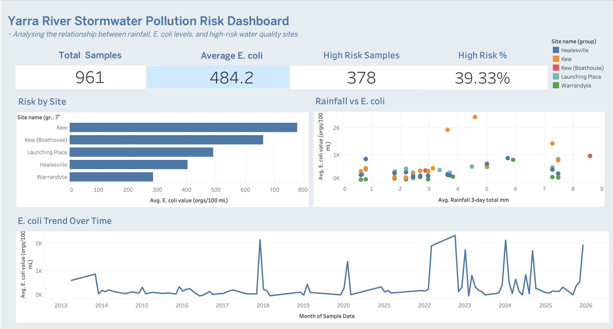

# Yarra River Stormwater Pollution Risk Dashboard

## Project Overview

This project analyses stormwater pollution risk across monitoring locations within the Yarra River catchment by examining E. coli contamination levels, rainfall patterns, and site-level environmental risk indicators.

The dashboard was developed in Tableau to transform raw environmental monitoring data into actionable insights for water quality management and environmental decision-making.

## Business Problem

Environmental agencies require reliable monitoring of water quality to identify pollution hotspots, assess public health risks, and understand the impact of rainfall on contamination levels.

The challenge was to consolidate environmental datasets into an interactive dashboard that enables users to:

* Monitor E. coli contamination trends
* Identify high-risk monitoring locations
* Assess the relationship between rainfall and water quality
* Support evidence-based environmental management decisions

## Objective

The objective was to convert raw environmental monitoring data into an interactive Tableau dashboard that provides clear visibility into pollution risks, site performance, and long-term water quality trends.

## Tools Used

* Tableau
* Microsoft Excel
* Data Cleaning
* Data Transformation
* Data Visualisation
* Environmental Data Analysis

## Datasets Used

* EPA Yarra Watch Water Quality Monitoring Data
* Bureau of Meteorology Rainfall Data

## Dataset Overview

* 961 Water Quality Samples
* Multiple Monitoring Sites Across the Yarra River Catchment
* Historical Rainfall and E. coli Measurements
* Multi-year Environmental Monitoring Records

## Dashboard Features

* Executive KPI Summary
* Total Water Quality Samples
* Average E. coli Levels
* High-Risk Sample Count
* High-Risk Percentage
* Risk by Monitoring Site
* Rainfall vs E. coli Correlation Analysis
* E. coli Trend Analysis Over Time
* Interactive Site Filtering

## Key Analysis

### Water Quality Risk Assessment

Samples were assessed against predefined risk thresholds to identify locations with elevated contamination levels and potential environmental concerns.

### Site Performance Analysis

Compared average E. coli levels across monitoring locations to identify pollution hotspots and prioritise areas requiring further investigation.

### Rainfall Impact Analysis

Examined the relationship between rainfall events and E. coli concentrations to determine whether stormwater runoff contributed to increased contamination levels.

### Trend Analysis

Analysed long-term changes in E. coli levels to identify recurring patterns, seasonal fluctuations, and unusual pollution events.

## Key Findings

* Analysed 961 water quality samples across multiple monitoring locations.
* 39.33% of samples were classified as high risk.
* Kew recorded the highest average E. coli concentration among monitored sites.
* Higher rainfall events were generally associated with increased E. coli levels, indicating potential stormwater runoff impacts.
* Water quality conditions varied significantly between monitoring locations.

## Data Quality Improvements

During data preparation, inconsistent site naming conventions were identified, particularly for Healesville monitoring locations.

Data standardisation techniques were applied to consolidate duplicate site names and improve reporting accuracy while preserving all valid records.

## Business Recommendations

1. Prioritise monitoring and mitigation efforts at high-risk locations.
2. Increase water quality monitoring following significant rainfall events.
3. Implement automated reporting dashboards to reduce reliance on spreadsheet-based reporting.
4. Standardise environmental data collection processes to improve data quality and consistency.
5. Use predictive monitoring approaches to proactively identify potential contamination events.

## Project Outcomes

* Consolidated environmental datasets into a single reporting solution.
* Improved visibility of pollution risks across monitoring locations.
* Identified high-risk sites and contamination trends.
* Demonstrated the relationship between rainfall and water quality indicators.
* Developed an executive Tableau dashboard to support environmental decision-making.

## Repository Contents

* Tableau Dashboard (.twb/.twbx)
* Dashboard Screenshots
* Source Datasets
* Project Documentation
* README
